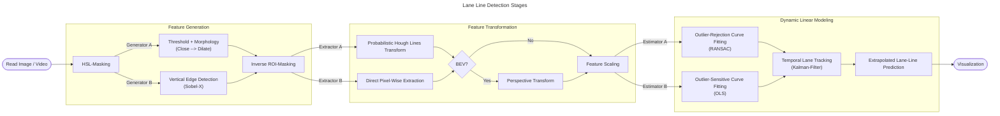

# Traffic-Conflict Detection

## Quick Start
### Install Package
```bash
git clone https://github.com/ShaneTeel/traffic-conflict-detection.git

cd traffic-conflict-detection
```

**For CPU-only**
```bash
python -m pip install torch torchvision --index-url https://download.pytorch.org/whl/cpu
```

**For project dependencies**
```bash
python -m pip install -r requirements.txt
```

**For developer mode**
```bash
python -m pip install -e .
```

### Run Demo Scripts
**Straight Lane Video**
```
python scripts/straight/straight_edge_direct_demo.py
```
**Curved Lane Video**
```
python scripts/curved/curved_edge_direct_demo.py
```
### For Single Video / Image processing
Define your ROI and run:
```python
from lane_detection.detection import DetectionSystem
import numpy as np

roi = np.array([[[100, 540], [900, 540], [525, 325], [445, 325]]])

system = DetectionSystem(
    source=<"filepath to video goes here">,
    roi=roi,
    generator="edge",
    selector="direct",
    estimator="ols"
)

report = system.run("composite", stroke=False, fill=True)

print(report)
```
[Return to TOC](#table-of-contents)


## Project Structure
```
lane_detection/
|-- detection/           # Main pipeline
│   |-- models/          # OLS, RANSAC, Kalman
|-- feature_generation/  # Edge/threshold maps
|-- feature_selection/   # Point extraction
|-- scalers/             # MinMax, StandardScaler
|-- image_geometry/      # ROI mask, BEV projection
|-- studio/              # Visualization
```
[Return to TOC](#table-of-contents)

## Methodology

### Pipeline Overview


[Return to TOC](#table-of-contents)

## Trade-Offs
**Feature Generation**

*Thresh*
- Amplifies both good pixel coordinates and bad pixel coordinates.
- Useful when the actual lane lines are faded / worn.

*Edge*
- Rejects noise resulting from horizontal lines
- Can generate too few points; not enough features to generate the right fit. 

**Feature Selection**

*Hough*
- Struggles with curved roads. 
- If BEV Transform were applied prior to `cv2.HoughLinesP()`, this issue is likely mitigated, but requires camera parameters (not included in this exercise).

*Direct*
- Much less resilient to outliers
- Requires special attention to the `n_std` argument to ensure outliers are filtered out appropriately.

**Estimators**

*RANSAC*
- Struggles with curved roads. 
- As polynomial degree increases, the minimum sample size needed results in an unstable fit. 
- Can reduce computational speed.

*OLS*
- Not very resistent to outliers.
- Requires a more deliberate feature generation / selection to ensure proper outliers filtering.

**BEV** (Optional)
- Aids in generating polylines that conform to the actual lane line locations.
- Reduces computational speed.
- Requires camera parameters (not included in this exercise) to improve use.

### Limitations

- Struggles with heavy road-noise (i.e., overpasses, road construction change (asphalt --> concrete))
- Requires manual ROI selection

[Return to TOC](#table-of-contents)

## Classical vs. Deep Learning
This project demonstrates **fundamental understanding** of classical computer vision techniques.

### Benefits of Classical CV

**The User Can Learn**:
- Coordinate transformation (homography)
- State estimation and filtering (Kalman)
- Robust regression techniques (outlier-rejection w/ RANSAC)
- Production system design (modularity, testing, logging, etc.)

**When to Use Classical**:
- System is resource constrained
- Interpretebility is critical
- Edge deployments, or more to the point, when a GPU is not needed
- Edge cases that challenge failure response

**Coming Soon!**: Comparitive analysis with YOLOv8 implementation
- Following implementation, author will update with a more thorough examination of the two approaches (classic vs deep learning).


[Return to TOC](#table-of-contents)

## To-Do
- Add unit tests for critical modules (e.g., Kalman, RANSAC, OLS, BEV/Homography).

[Return to TOC](#table-of-contents)