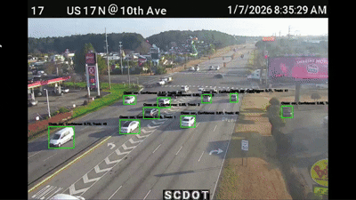
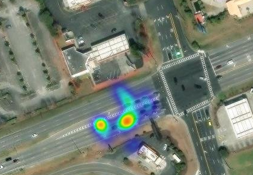
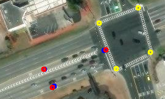
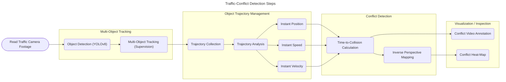

# Traffic-Conflict Detection

Computer vision system that detects, catalogues, and geolocates vehicle conflict events from traffic camera footage by transforming pixel-space conflict coordinates into real-world geographic coordinates.

## Table-of-Contents
- [Example Outputs](#example-outputs)
- [Key Features](#key-features)
- [Quick Start](#quick-start)
- [Data Source](#data-source)
- [Project Structure](#project-structure)
- [Workflow](#workflow)
- [Citation](#citation)
- [License](#license)

## Example Outputs
### Multi-Object Tracking Output


### Conflict Detection / Inverse Perspective Mapping Output (Heatmap)


## Key Features
### Real-Time Trajectory Collection
- Combines YOLOv8 with Supervision for persistent object tracking across frames
- Collects tracked object trajectory data and formats for trajectory analysis

### Time-to-Collision Calculation
- Computes instant position, speed, and velocity for each tracked object
- Performs "sweep" time-to-collision for every possible timestamp an object is in frame to determine vulnerability to conflict

### Inverse Perspective Mapping (Image --> Real-World Projection)
- Custom inverse perspective mapping pipeline transforms pixel-space conflict coordinates to geographic coordinates
- Achieves an RMSE score of 1.47 meters and a MAE score of 1.81 meters (see below)

### Inverse Persepective Mapping metrics:

**Root Mean Squared Error**: 1.47 meters

|Point # | East Error (Squared) | North Error (Squared) | Total Error (Squared) |
|--------|----------------------|-----------------------|-----------------------|
|0       | 0.06                 | 0.06                  | 0.12                  |
|1       | 1.72                 | 1.00                  | 2.72                  |
|2       | 2.64                 | 1.00                  | 3.64                  |

**Mean Absolute Error**: 1.81 meters

|Point # | East Error (Abs) | North Error (Abs) | Total Error (Abs) |
|--------|------------------|-------------------|-------------------|
|0       | 0.25             | 0.25              | 0.50              |
|1       | 1.31             | 1.00              | 2.31              |
|2       | 1.62             | 1.00              | 3.62              |


- Yellow == Ground Control Points
- Green == Ground Truth (Validation Points)
- Red == Prediction

[Return to TOC](#table-of-contents)

## Quick Start
### Install Package
```bash
git clone https://github.com/ShaneTeel/traffic-conflict-detection.git

cd traffic-conflict-detection
```

**For CPU-only**
```bash
python -m pip install torch torchvision --index-url https://download.pytorch.org/whl/cpu
```

**For project dependencies**
```bash
python -m pip install -r requirements.txt
```

### Example Usage (Joe White Blvd., Myrtle Beach, SC)
**In Script**
```python
from numpy.typing import NDArray

from conflict_detection.detect import DetectionSystem
from conflict_detection.visualize import *
from conflict_detection.utils import get_logger, setup_logging

from conflict_detection.demo import SRC_PTS, DST_PTS

logger = get_logger(__name__)

setup_logging(
    log_level="INFO",
    log_to_file=True,
    log_dir="../logs/traffic",
    console_output=True
)

def main(file_in:str, file_out:str, model_path:str, dst_pts:NDArray, src_pts:NDArray):
 
    system = DetectionSystem(file_in, file_out, dst_pts, src_pts, model_path=model_path)
    
    conflicts = system.monitor_traffic()
    
    system.inspect_conflicts(conflicts, file_out="./media/out/TTC-conflicts-heatmap.html")
    
if __name__ == "__main__":
    file_in = "./media/in/US_17_N_10th_Ave_20260107.mp4"
    file_out = "./media/out/US_17_N_10th_Ave_20260107-processed.mp4"

    model_path = "./models/yolov8m.pt"

    main(file_in, file_out, model_path, DST_PTS, SRC_PTS)
```

[Return to TOC](#table-of-contents)

## Data Source
This project uses traffic camera footage from US 17 N @ 10th Ave (Joe White Blvd), Myrtle Beach, South Carolina available at [SCDOT 511](https://www.511sc.org/#zoom=7.392317422778981&lon=-79.18444413926545&lat=33.54795719951041&dmsg&rest&cams&other&cong&wthr&acon&incd&trfc).

The techniques applied in the `conflict_detection` package have legitimate applications in:
- Urban planning and transportation
- Vision Zero initiatives
- Academic vehicle mobility studies

## Project Structure
```
conflict_detection/
|-- detect/                 # Main conflict calculation and detection logic
|-- geometry/               # Pixel-Space to Real-World coordinate projection
|-- multi_object_tracking/  # Multi-Object Detection / Tracking logic
│   |-- object_detector.py  # YOLOv8 wrapper for object detection
|   |-- object_tracker.py   # Supervision multi-object tracking
|-- trajectory/             # Collection and analysis logic for tracked objects
|-- utils/                  # Logging, Homography Projection Metrics (RMSE / MAE)
|-- visualize/              # Folium Maps, Video File Manager
|   |-- studio/             # OpenCV Video File Handling / Illustration / Rendering
```

[Return to TOC](#table-of-contents)

## Workflow

### Pipeline Overview

```mermaid
---
title: Traffic-Conflict Detection Steps
---
flowchart LR;
    A([Read Traffic Camera Footage]) --> B;

    subgraph Multi-Object Tracking
        B("Object Detection (YOLOv8)") --> C;
        end
    
    C("Multi-Object Tracking (Supervision)") --> D;

    subgraph Object Trajectory Management
        D("Trajectory Collection") --> E;
        E("Trajectory Analysis") --> F;
        E --> G;
        E -->H;
        end
    F("Instant Position") --> I;
    G("Instant Speed") --> I;
    H("Instant Velocity") --> I;

    subgraph Conflict Detection;
        I(Time-to-Collision Calculation) --> J;
        end

    I --> L
    J(Inverse Perspective Mapping) --> K;

    subgraph Visualization / Inspection;
        K(Conflict Heat-Map);
        L(Conflict Video Annotation)
        end
```

[Return to TOC](#table-of-contents)

## Citation
If you use this package or software, please cite it as follows:

```bibtex
@misc{ShaneTeel2026,
    author = {Shane Teel},
    title = {Traffic-Conflict Detection},
    howpublished = {\url{https://github.com/ShaneTeel/traffic-conflict-detection}},
    year = {2026},
    note = {Version 0.1.0, accessed March 04, 2026}}
```

[Return to TOC](#table-of-contents)

## License
This project is licensed under an All Rights Reserved [License](./LICENSE)

**Copyright (c) 2026 Shane Teel**

[Return to TOC](#table-of-contents)